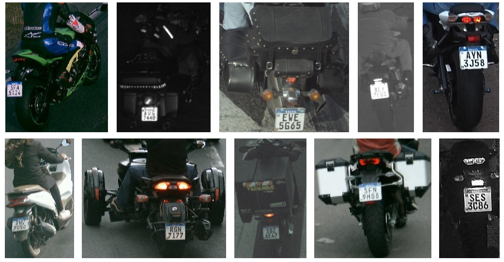

# UFPR-MoTri Dataset
 
## A Fine-Grained Classification Dataset for Two- and Three-Wheeled Vehicles In Urban Traffic.
 
UFPR-MoTri images were originally provided by Military Police of Paraná (PMPR). Based on this data, the dataset was constructed, annotated and structured specifically for fine-grained vehicle classification. It consists of 94,083 images across 41,838 unique vehicles. Since images come from real-world security and surveillance cameras, the dataset offers various angles and backgrounds, partially occluded vehicles and low-resolution images.
The dataset captures a high variability of two- and three-wheeled vehicles, covering both internal combustion and electric models such as motorcycles, scooters, e-scooters, mopeds, and tricycles. To enable precise classification tasks, the annotations are highly detailed: each vehicle is labeled with its official CONTRAN legal type (the Brazilian National Traffic Council classification) along with a specific categorization into 12 fine-grained visual subtypes.
 
While existing fine-grained datasets that focus on cars, UFPR-MoTri introduces a reference dataset for underrepresented two- and three-wheeled vehicles, including motorcycles and tricycles.
 
**NOTE**: Only rear-view images are available. This is because image capture is exclusively triggered in ALPR (Automatic License Plate Recognition) scenarios, and these vehicles only have license plates located in the rear.
 
### General Characteristics
* Lighting Variations: Captures images ranging from daylight scenes to night-time scenes with low illumination.
* Occlusions: Features partially occluded caused by cargo compartments, passengers and camera angles.
* Vehicle Customization: Includes custom motorcycles and tricycles with modified structures, bodies, and plate positions, increasing intra-class variance that challenges classification.
 
Examples of images from the UFPR-MoTri dataset can be seen bellow.
 

   

   Fig. 1: Examples of two- and three-wheeled vehicles in different lighting conditions and with partial occlusions.

 
Because the data comes from urban traffic cameras, the dataset presents several real-world challenges for computer vision models. It captures lighting variations, ranging from daylight scenes to night-time environments with low illumination. The images also feature frequent occlusions caused by cargo compartments, passengers, and difficult camera angles. Furthermore, the dataset highlights extensive vehicle customization, including custom motorcycles and tricycles with modified structures, bodies, and non-standard plate positions. This significantly increases intra-class variance, providing a robust ch    allenge for fine-grained classification algorithms.
 
### How to obtain 
 
The UFPR-MoTri dataset is restricted to non-commercial academic research. It is freely available to researchers affiliated with educational institutions upon signing a licensing agreement.
 
To request access, please review, sign, and return the **[license agreement](pdf/UFPR-MoTri_License-Agreement.pdf)** to Professor David Menotti (menotti@inf.ufpr.br). All requests must be sent from an official institutional email address (e.g., .edu, .ac) and must include the subject line **UFPR-MoTri Dataset Access**.
